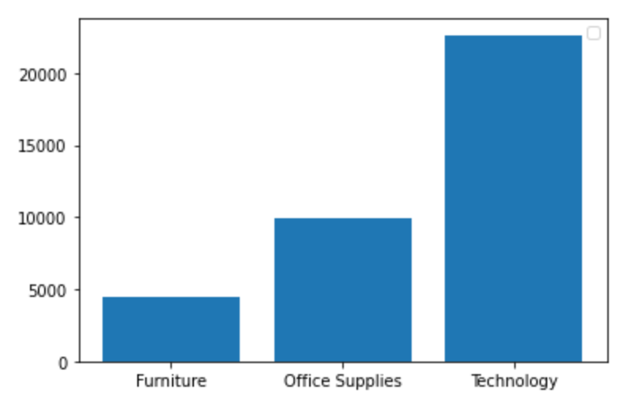
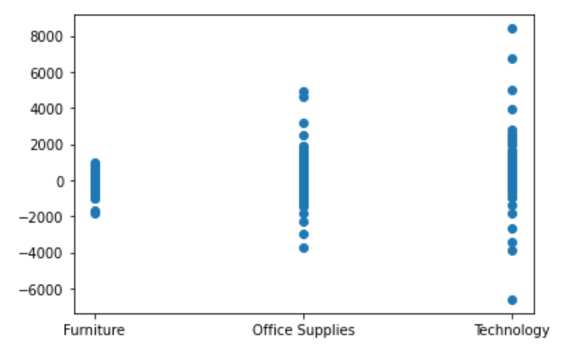

# project2 - sales predictions
# Predicting Future Sales
## Using preprocessing and data modelling

Jerry Qian

### Business problem:

The goal is to help the retailer by using machine learning to make predictions about future sales in certain categories based on the data provided.

### Data:
I provide visualizations for the data, detailed below. I also examine the data using preprocessing and regression modeling.

## Methods
- Preprocessing and data modelling to examine the training data and testing data accuracy
- Visualizations to help understand the data

## Results

#### Visual 1 Title

> According to the bar chart, we have the most sales in the technology sector and the least sales in the furniture sector.

#### Visual 2 Title

Based on the scatter chart visual above, we notice a greater range of profit/loss in the technology sector. We also notice major outliers here. And combined with the first visual, we can conclude that greater sales contribute to a wider varying profit/loss.

After our feature engineering step, our training and test data have moved even closer, and both scores regardless of model are much closer to 1.
I choose the post-feature engineering decision tree as my production model because the training and test scores are very close together and lean towards 1. The chart also looks stable. It can be used to accurately estimate future sales.

### For further information

For any additional questions, please contact jerryqian123@gmail.com
